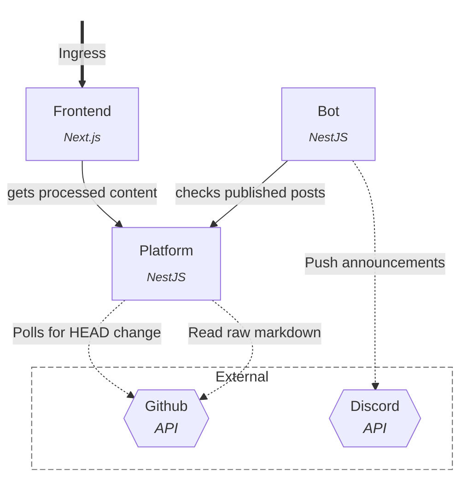

# GRB

The platform backing my blogs:
- [gregros.dev](https://gregros.dev)
- [gregros.xyz](https://gregros.xyz)
## Components
Currently the design looks like this:

GRB is deployed on a k8s cluster, with a single HTTPRoute resource that provides ingress for the Frontend component. 
### Frontend
The Next.js service that builds the UI. This is the only service that’s accessible from outside. 
### Bot
A Discord announcer that regularly polls Platform for new posts to announce.
### Platform
Central component that:

1. Abstracts the data source (can take from github or local)
2. Caches content.
3. Regularly polls data source for changes to update the cache.
4. Processes markdown:
	1. Extracts headings
	2. Extracts excerpts
	3. Processes frontmatter
	4. Renders math

## CI/CD
Deployed resource include:
1. A container  image for each service.
2. An OCI artifact with k8s manifests.

These are synced into the k8s cluster (internal network).

Building images and manifests is handled via bash and buildkit for maximum portability.

Deployment proceeds like this:
- Matrixed workflow decides what to build (can also be passed as input)
- The image job for a service builds its container image.
	- Executes <scripts/image.run.sh> which initiates the build with env vars.
	- Most of the work happens inside the `Dockerfile`.
	- The image is pushed to `ghcr.io`.
- The manifest job for a service builds its k8s manifests:
	- Executes <scripts/manifest.run.sh>.
	- Including the Deployments, Services, and HTTPRoute.
	- Sets up production environment.
	- References secrets present in the cluster.
	- Pushed via ORAS to `ghcr.io`
- Flux (lives in cluster) polls github for changes to manifests.
- When change occurs, it pulls and reconciles resources.
- This is monitored using Weave GitOps.
